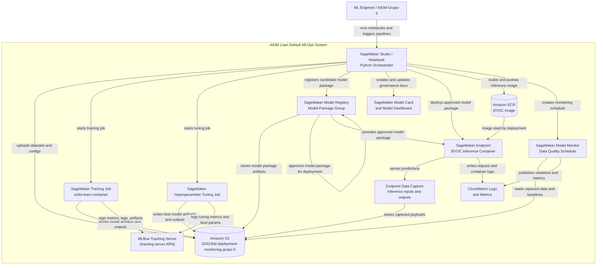

```mermaid
flowchart TB
  user["ML Engineer / AIDM-Grupo-5"]

  subgraph boundary["AIDM Loan Default MLOps System"]
    studio["SageMaker Studio / Notebook<br/>Python Orchestrator"]

    train["SageMaker Training Job<br/>scikit-learn container"]
    hpo["SageMaker Hyperparameter Tuning Job"]

    reg["SageMaker Model Registry<br/>Model Package Group"]
    card["SageMaker Model Card<br/>and Model Dashboard"]

    ecr[("Amazon ECR<br/>BYOC Image")]
    endpoint["SageMaker Endpoint<br/>BYOC Inference Container"]

    datacapture["Endpoint Data Capture<br/>Inference inputs and outputs"]
    monitor["SageMaker Model Monitor<br/>Data Quality Schedule"]

    cw["CloudWatch Logs<br/>and Metrics"]
    mlflow["MLflow Tracking Server<br/>(tracking server ARN)"]
    s3[("Amazon S3<br/>i32419/ai-deployment-monitoring-grupo-5")]
  end

  user -->|runs notebooks and triggers pipelines| studio

  %% Data preparation
  studio -->|uploads datasets and configs| s3

  %% Training & HPO
  studio -->|starts training job| train
  studio -->|starts tuning job| hpo

  train -->|writes model artifacts and outputs| s3
  hpo -->|writes best model artifacts and outputs| s3

  train -->|logs metrics, tags, artifacts| mlflow
  hpo -->|logs tuning metrics and best params| mlflow

  %% Registry & governance
  studio -->|registers candidate model package| reg
  reg -->|stores model package artifacts| s3
  studio -->|creates and updates governance docs| card

  reg -->|approves model package for deployment| reg
  reg -->|provides approved model package| endpoint
  studio -->|deploys approved model package| endpoint

  %% BYOC build & deploy
  studio -->|builds and pushes inference image| ecr
  ecr -->|image used by deployment| endpoint

  %% Inference & data capture
  endpoint -->|serves predictions| datacapture
  datacapture -->|stores captured payloads| s3

  %% Monitoring
  studio -->|creates monitoring schedule| monitor
  monitor -->|reads captured data and baselines| s3
  monitor -->|publishes violations and metrics| cw

  endpoint -->|writes request and container logs| cw
```