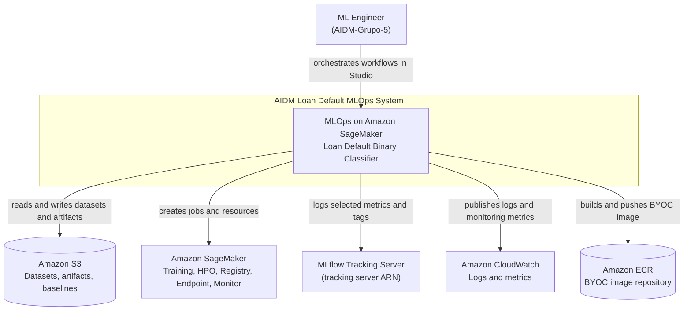

```mermaid
flowchart TB
  person["ML Engineer<br/>(AIDM-Grupo-5)"]

  subgraph sys["AIDM Loan Default MLOps System"]
    system["MLOps on Amazon SageMaker<br/>Loan Default Binary Classifier"]
  end

  s3[("Amazon S3<br/>Datasets, artifacts, baselines")]
  sm["Amazon SageMaker<br/>Training, HPO, Registry, Endpoint, Monitor"]
  ecr[("Amazon ECR<br/>BYOC image repository")]
  mlflow["MLflow Tracking Server<br/>(tracking server ARN)"]
  cw["Amazon CloudWatch<br/>Logs and metrics"]

  person -->|orchestrates workflows in Studio| system

  system -->|reads and writes datasets and artifacts| s3
  system -->|creates jobs and resources| sm
  system -->|logs selected metrics and tags| mlflow
  system -->|publishes logs and monitoring metrics| cw
  system -->|builds and pushes BYOC image| ecr
```